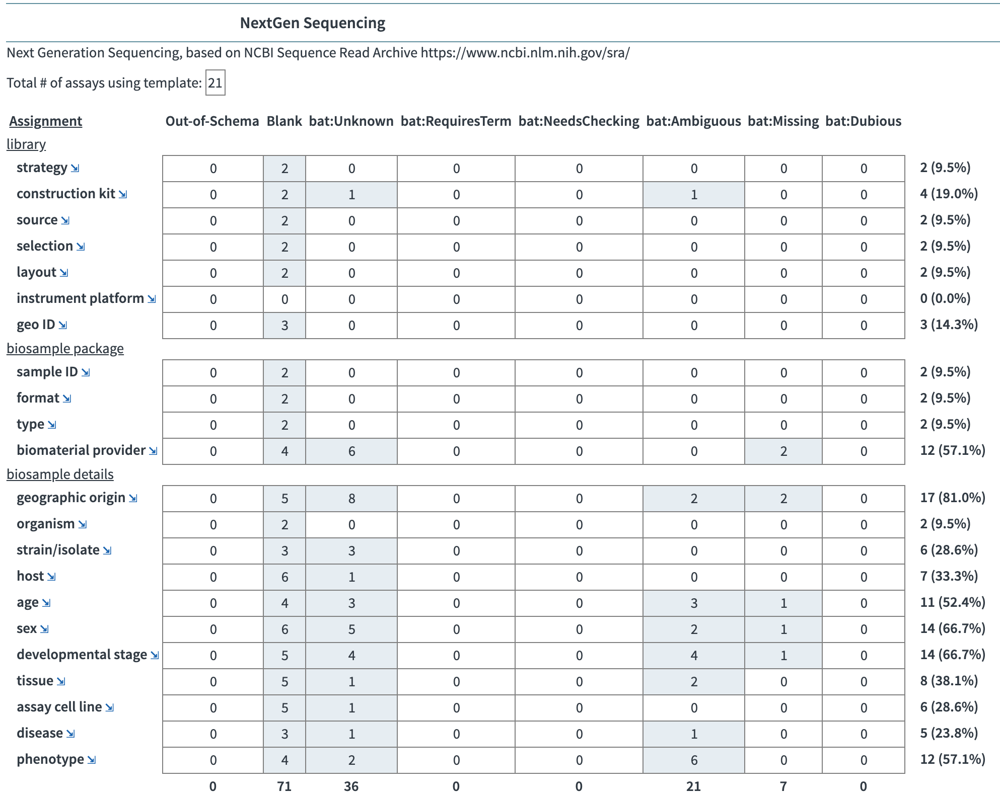
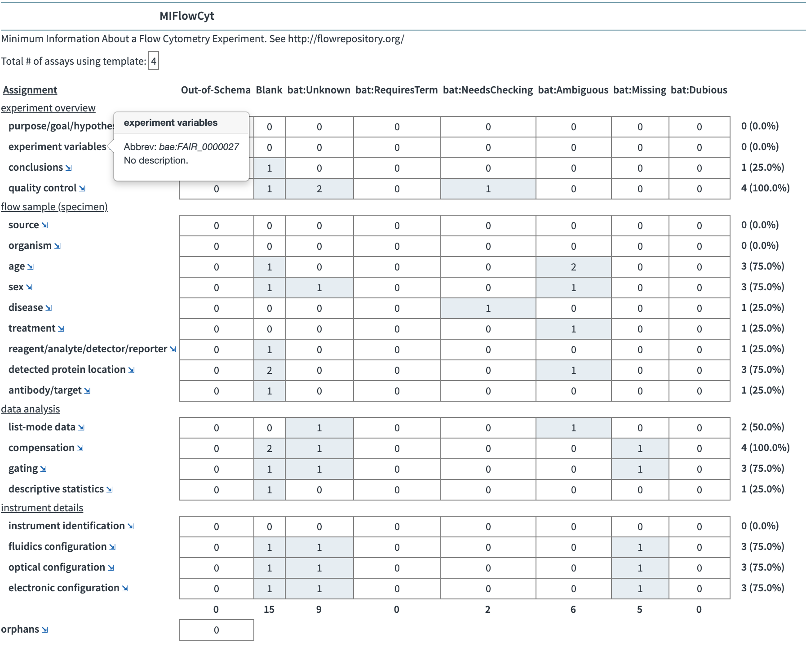

# FAIR Data Hackathon Bio-IT World 2019

Materials for the hackathon in April 2019, for the section hosted by [Collaborative Drug Discovery](http://collaborativedrug.com): **BioAssay Express: Applying FAIR Principles to Bioassay Protocols** (see [site](https://www.bio-itworldexpo.com/fair-data-hackathon)).

This part of the hackathon event is about evaluating journals to see how well they adhere to guidelines for describing their experiments completely, according to the following schemes:

* NextGen Sequencing
* MIARE: Minimum Information About an RNAi Experiment
* MIFlowCyt: The Minimum Information About a Flow Cytometry Experiment
* MIQE: Minimum Information for Publication of Quantitative Real-Time PCR Experiments
* MISFISHIE: Minimum information specification for in situ hybridization and immunohistochemistry experiments

To make this work, we are customizing an instance of BioAssay Express - [https://fair.bioassayexpress.com](https://fair.bioassayexpress.com) with new templates for each of these categories. We will be using the tool to annotate as many literature protocols as we can, and at the end of the day, we will find out how well they are doing!

In addition, the BioAsssay Express API can now be explored using SmartAPI [http://bioassayexpress.smart-api.info/](http://bioassayexpress.smart-api.info/).

## ABOUT US

[Collaborative Drug Discovery](https://collaborativedrug.com)

* Samantha Jeschonek
* Alex Clark
* Marcin Pilarcyk

## RESULTS

The 5 templates are stored on this GitHub repository in [templates/](https://github.com/NCBI-Hackathons/BioAssay-Express-Applying-FAIR-Principles-to-Bioassay-Protocols/tree/master/templates). Additional ontologies to support these templates are in [ontology/](https://github.com/NCBI-Hackathons/BioAssay-Express-Applying-FAIR-Principles-to-Bioassay-Protocols/tree/master/ontology). The BioAssay Template Editor is open source [see GitHub/bioassay-template](https://github.com/cdd/bioassay-template).

Over 2 days we have curated dozens of assays from the literature (PubMed Central) using the 5 templates. Statistics on how well the curation process works can be found on the public server: [https://fair.bioassayexpress.com/diagnostics/absence.jsp](https://fair.bioassayexpress.com/diagnostics/absence.jsp)

For each template, we break down the numbers of:

* **blank** fields
* values marked as **unknown**, **ambiguous**, **missing** or **dubious**
* proportion of undesirable results (%)

The fully list of curated assays can be downloaded at any time from the page [https://fair.bioassayexpress.com/REST/RDF/all](https://fair.bioassayexpress.com/REST/RDF/all), either as a ZIP file with JSON-formatted assays, or semantic web formats. Periodic backups are also found on the GitHub site [backup/](https://github.com/NCBI-Hackathons/BioAssay-Express-Applying-FAIR-Principles-to-Bioassay-Protocols/tree/master/backup).

## CONCLUSIONS

Reports on the curation efforts for this hackathon are shown below.

43 assays were curated, for the whole template collection. About half of them are for Next Gen Sequencing. Some fields are generally well represented, and easy to find. Others are generally absent, or were not obvious to us.

367 provisional terms were created during the exercise. Some of the fields had little/no preexisting ontology options, while others were already well populated.

Several real-time hacks on the service itself were implemented and applied before & after the hackathon (e.g. improving the report page). Numerous software improvements (and a few glitches) were found and added to our to-do list!

